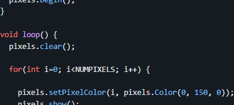

## Day 1 (remote), section 2: intro to (simulator) Arduino

_In the previous section, we learned the very basics of C++ to write simple PC programs._
_Now, we'll use that to write embedded code in a simulator._ 

_We'll write code using [Arduino](https://www.arduino.cc/), a popular platform that makes it easy to get started writing embedded programs by providing intuitive functions like `digitalWrite()` that wrap the magic happening under the hood._


### Simulator: Wokwi

Embedded code generally needs to be deployed on a physical microcontroller.
Since we're remote today, we'll use a simulator, [Wokwi](https://wokwi.com/).

You don't need to sign up for an account for what we'll be doing today.


## Activity 1.1: Hello ~~world~~ blinky

While the first example for C++ on a PC was printing "Hello, world!" to the console, embedded devices often lack a screen.
Instead, the first program is commonly to blink an LED.

Like with Hello, world!, we'll provide a base to build on.
**[Start with this linked Wokwi project](https://wokwi.com/projects/369909925978652673), which includes a circuit and example code.**  


Let's go over the circuit first:  

- At the heart is a ESP32, a low-cost microcontroller with WiFi and Bluetooth that is popular with the maker community.
  - Think of a microcontroller as a low-end computer on a chip: it has a CPU, memory, and storage.
  - It also has pins which are controlled by the processor.
    These have a variety of capabilities, but the most basic is digital GPIO (general purpose input / output).
- One of these GPIO pins (D2 in this case) is connected to an LED and resistor.
  - LEDs light up when power is applied, and the resistor limits the power to reasonable level to avoid component damage.
  - Roughly speaking for this circuit, when the GPIO is set to `1` or `HIGH`, the pin provides power to the LED.
    When the GPIO is set to `0` or `LOW`, no power is applied to the LED.

> <details><summary>⚡ A more detailed but accurate explanation of the circuit...</summary>
> 
>   - GPIOs actually function by working with voltages on the pin.
>     - On the output side, writing a `0` or `1` to the pin sets the voltage to ground (0v) or the positive supply (3.3v).
>     - On the input side, the voltage can be read from the pin, approximated to either 0 (if it's much closer to 0v) or 1 (if it's much closer to 3.3v).
>   - Pins may have other functions too, including analog (reading or writing a voltage as a more continuous value, for example 0 to 3.3v in 1024 equal steps) or digital communication protocols. 
> 
>   - LEDs light up when a current flows through them.
>     The voltage between a LED's terminals induces this current to flow.
>     - When the GPIO is set to `0`, 0v is on the pin, and there is 0v difference across the LED (to ground).
>       No current flows, LED does not light up.
>     - When the GPIO is set to `1`, 3.3v is on the pin, and there is 3.3v difference across the LED (to ground).
>       This induces current to flow across the LED, and it lights up.
>   - The resistor limits current across the LED.
>     LEDs can be damaged by excessive current (typically above 20mA for low-power LEDs), and the resistor limits the current to a reasonable amount.
> </details>

Let's move onto the code now:  
```cpp
const int kLedPin = 2;


void setup() {
  // put your setup code here, to run once:
  pinMode(kLedPin, OUTPUT);

  Serial.begin(115200);
  Serial.println("Hello, ESP32!");
}

void loop() {
  // put your main code here, to run repeatedly:
  digitalWrite(kLedPin, HIGH);
  delay(500);
  digitalWrite(kLedPin, LOW);
  delay(500);
}
```

Run it (with the arrow button) and you should see the red LED blinking on and off!  
  

While this is still C++ code, this differs from the prior examples significantly.
- There is no `main()` function, instead, there are two functions: `setup()` and `loop()`.
  `setup()` is called once on startup, after which `loop()` is repeatedly called over and over again while the program is running.
  You can think of `main()` being defined in Arduino with something like:
  ```cpp
  int main() {
    setup();
    while (true) {
      loop();
    }
  }
  ```
  - You might not have seen the `while` loop before: it keeps executing the loop while the condition is true.
    Here, the condition is always true, so it will loop forever.
    This is common in embedded systems, which often run some continuous function, instead of once-and-done.
- It's often good practice to define give a name to constants, like pin numbers.
  - Here, we define `kLedPin` to be 2, which is the pin we've connected the LED to.
  - In other code, you may see other ways to define pins, one common one being `#define LED_PIN 2`.
    Our `const int` style uses a generally cleaner mechanism, but these are (in most cases) equivalent.
- `setup()` is commonly used to configure hardware.
  - Here, we first configure the GPIO as an output using `pinMode(...)` so it can drive the LED.
  - We also configure the serial port, which we'll use to print messages.
    Although the ESP32 doesn't have a screen, it does have a serial port (represented by the `Serial` object) that can be used to send data to a connected PC.
    - Objects are the first use of a C++ construct, up until now we've only been using C features.
      `Serial` is an object, and behaves similar to objects in Python where you can call functions on them (using the dot syntax, same as Python), and they can have internal variables.
      `Serial` is pre-defined for you by Arduino.
    - `Serial.begin(115200)` configures the baud rate (data rate, bits per second) to 115200, a common speed.
      Both the transmitter and receiver must agree on the data rate.
    - `Serial.println("Hello, ESP32!")` prints a message to the console.
      `println` includes a newline at the end, different from `printf` and `print`.
    - In Wokwi, you can see this out put when you run:  
        
      Ignore the stuff above `Hello, ESP32!`, the ESP32 prints system configuration details on startup for debugging.
- `loop()` contains the main program logic.
  - `digitalWrite(kLedPin, HIGH)` sets the pin voltage high, lighting up the LED.
  - `delay(500)` pauses the program for 500 milliseconds (0.5 seconds).
  - `digitalWrite(kLedPin, LOW)` sets the pin voltage low, turning off the LED.
  - There's one more delay, then this all repeats with the next `loop()`.
- Arduino provides a lot of functionality, and an overview reference is available here: [https://www.arduino.cc/reference/en/](https://www.arduino.cc/reference/en/)

> <details><summary>⚡ A more detailed but accurate explanation of pin directionality...</summary>
> 
>   - Internally, GPIOs have an output driver (which drives the pin voltage to either ground or positive supply) that can be turned off.
>   - When turned off (in `INPUT` mode), `digitalWrite` has no effect.
>     This is sometimes called _tristating_, referring to the third state (`0`, `1`, and undriven or `Z`).
>     - `Z` means hi-Z, or high-impedance (high-resistance) as a disconnected pin in concept has infinite resistance.
>   - When turned on, (in `OUTPUT` mode), the output driver is enabled, and the pin state is determined by `digitalWrite`.
>   - Pins can be read in output mode, this (probably) samples the voltage on the pin, which is usually the result of `digitalWrite`.
> </details>


### Now you try!

Adjust the code so that the LED blinks once every two seconds, and with 75% of the time on and 25% of the time off.

<details><summary><span style="color:DimGrey"><b>Solution</b> (try it on your own first!)</span></summary>

  For this, we only need to change the delay that controls how long the LED is on.

  ```cpp
  void loop() {
    // put your main code here, to run repeatedly:
    digitalWrite(kLedPin, HIGH);
    delay(1500);
    digitalWrite(kLedPin, LOW);
    delay(500);
  }
  ```
</details>


## Activity 1.2: Switch input

While blinking LEDs are fun, sensing and reading inputs are typically critical parts of any useful device.

Start by adding a button to your circuit.
Click the + button to add a component (if the simulation is running, you'll need to stop it first to see the + button):  
  
- If you see this, you need to stop the simulation first:  
    

Then, select "pushbutton" from the list:  
  
The component will appear on the circuit, drag it to somewhere reasonable on the left of the ESP32:  
  
Wire the button up to the ESP32:
- Click a pin to start a wire, then click the other pin to connect them.  
  
  - While wiring, you can click anywhere to insert a bend in the wire.
- Connect the top pin of the button to D13 on the ESP32.
- Connect the bottom pin of the button to GND on the ESP32.

The connected circuit might look like this:  


With the circuit built, let's write some code to read the button.
```cpp
const int kLedPin = 2;
const int kButtonPin = 13;


void setup() {
  // put your setup code here, to run once:
  pinMode(kLedPin, OUTPUT);
  pinMode(kButtonPin, INPUT_PULLUP);

  Serial.begin(115200);
  Serial.println("Hello, ESP32!");
}

void loop() {
  // put your main code here, to run repeatedly:
  digitalWrite(kLedPin, !digitalRead(kButtonPin));
}
```

What's going on here?
- The switch is a component that connects (shorts) its pins when the button is pressed.
  - When the button is pressed, the GPIO reads a `0` (`LOW`) since the button is connected to GND.
  - We need to configure the pin as `INPUT_PULLUP` to provide a default value of `1` (`HIGH`) when the button is not pressed. 
- The `!` operator inverts the value of the expression: `0` becomes `1` and `1` becomes `0`.
  So the conditional is `true` when the button pin reads `0` (`LOW`), or pressed.

> <details><summary>⚡ A more detailed but accurate explanation of the switch...</summary>
> 
>   - When the switch is not pressed, the ESP32 pin is floating (disconnected) and indeterminate unless driven by something else.
>     From software, we can configure the pin as `INPUT_PULLUP` which enables a pull-up resistor on the GPIO pin that weakly pulls up the pin to the positive supply and reads as a digital 1.
>     - Because it's a weak pullup, the switch's connection to ground 'wins' when the button is pressed.
>   - This the conventional way to connect switches, with the pin weakly pulled high when the button is not pressed, and forced to ground when the button is pressed.
>     - You could do the opposite, but it's less common.
> </details>

Before you simulate it, what do you think will happen?

### Now you try!

While the above example completely removes the blinking LED, bring back the blinking LED with a twist: the LED should only blink when the button is pressed, and should be off otherwise.
It's up to you how long the LED takes to react to a button press or release, but opt for the simpler solution.

<details><summary><span style="color:DimGrey"><b>Solution</b> (try it on your own first!)</span></summary>

  ```cpp
  void loop() {
    // put your main code here, to run repeatedly:
    if (!digitalRead(kButtonPin)) {  // just gate the blinking with an if conditional on the button state 
      digitalWrite(kLedPin, HIGH);
      delay(1500);
      digitalWrite(kLedPin, LOW);
      delay(500);
    }
  }
  ```
</details>


## Activity 1.3: NeoPixel ring

What's better than one blinking LED?
Lots of multi-color LEDs!

While we could do this with a bunch of individual LEDs, each LED would require its own individual pin from the microcontroller.
This won't scale to fun numbers of LEDs.

Instead, we'll use NeoPixels, which are devices that have an RGB (red-green-blue - can be mixed to be any color) and an integrated controller that can be controlled from a single digital signal.
Even better, these can be chained, allowing arbitrarily ridiculous numbers of LEDs to be connected from just one microcontroller pin.

> Naming note: NeoPixel is the Adafruit brand name for these devices, but informally commonly refers to a wide variety of similar devices of daisy-chainable RGB LEDs. 

> <details><summary>⚡ A more detailed explanation of NeoPixels and signals...</summary>
> 
> A digital signal is a time-varying waveform that can be used to convey data.
> NeoPixels define a protocol where the red, green, and blue intensities for each device are encoded into a series of digital `1`s and `0`s with specified timing.
> The details aren't relevant for this lab, but you can find more online if you're curious.
> </details>

Add the NeoPixel ring, just like you did with the switch:  
  
And wire it up:
- NeoPixel GND to ESP32 GND,
- NeoPixel VCC to ESP32 VIN,
- NeoPixel DIN to ESP32 D12.
- NeoPixel DOUT disconnected.

The connected circuit might look like this (yes, the wiring is a mess...):  


Now, for the software.
In theory, you could read the [chip datasheet](https://cdn-shop.adafruit.com/datasheets/WS2812B.pdf), understand the signaling protocol (page 4), and use a series of `digitalWrite(...)` and `delay(...)` to generate the required signal, but that's a lot of (actually pretty tricky) work.
Instead, for common components, especially components the maker community likes, you can typically find libraries that wraps the lower-level details into a more intuitive interface.

Here, we'll use the Adafruit NeoPixel library.
You'll need to install this in Wokwi:
- On the left, go to the Library Manager tab.
- Click the +.
- Search for "neopixel".
- Add "Adafruit NeoPixel


> If you're curious, you can find the library repository and readme on GitHub at [https://github.com/adafruit/Adafruit_NeoPixel](https://github.com/adafruit/Adafruit_NeoPixel).
> We'll summarize what you need to know for the lab here, but if you were working on your own, the readme is a good place to start.

> While using libraries can save you a lot of time, **there may be obligations depending on the license.**
> **Open-source does not always mean 'free for any purpose'**, some licenses, for example, require you to license your code under the same terms (usually only applicable if you distribute the software, potentially including as part of a device).
> These are legally enforceable under (a somewhat creative use of) copyright law.
> If you're the kind of person who likes to tinker with stuff or benefits from right-to-repair, why not give others the same opportunity and open-source your work too!
> And if you're the kind of person who's going to champion planned obsolescence, well you too can reap the results of heaps of unnecessary e-waste and climate change.

With the library imported, try running this example code:
```cpp
const int kLedPin = 2;
const int kButtonPin = 13;
const int kNeopixelPin = 12;

#include <Adafruit_NeoPixel.h>
const int kNeopixelCount = 16;
Adafruit_NeoPixel LedRing(kNeopixelCount, kNeopixelPin);

void setup() {
  // put your setup code here, to run once:
  pinMode(kLedPin, OUTPUT);
  pinMode(kButtonPin, INPUT_PULLUP);

  Serial.begin(115200);
  Serial.println("Hello, ESP32!");

  LedRing.begin();
}

void loop() {
  // put your main code here, to run repeatedly:
  for (int i=0; i<kNeopixelCount; i++) {
    LedRing.setPixelColor(i, LedRing.Color(0, 150, 0));
  }
  LedRing.show();
  delay(100);
}
```

Once again, there's a few new things in this example:
- We've already covered `#include` in the prior Intro to C++ section.
- While we've covered object use above, here you have to create the `Adafruit_NeoPixel` object.
  - The syntax for creating an object in C++ is the class name, variable name, and arguments.  
    `Adafruit_NeoPixel LedRing(kNeopixelCount, kNeopixelPin);` means to create an object of class `Adafruit_NeoPixel`, named `LedRing`, and with arguments `kNeopixelCount` and `kNeopixelPin`.  
    > <details><summary>🐍 The Python equivalent would be...</summary>
    > 
    >   ```python
    >   LedRing = Adafruit_NeoPixel(kNeopixelCount, kNeopixelPin)
    >   ```
    > </details>
  - When you're familiar with the base language, one trick to quickly getting started with a library is to look for an example and pattern-match.
    Here, we've largely adapted the Adafruit NeoPixel example on the readme, [https://github.com/adafruit/Adafruit_NeoPixel#simple](https://github.com/adafruit/Adafruit_NeoPixel#simple):
    
  - You can also look for the library interfaces.
    In [Adafruit_NeoPixel.h](https://github.com/adafruit/Adafruit_NeoPixel/blob/ca89075cc5091a06ac5e5f162a467b877f95f00c/Adafruit_NeoPixel.h#L219), the object constructor is defined as  
    `Adafruit_NeoPixel(uint16_t n, int16_t pin = 6,
    neoPixelType type = NEO_GRB + NEO_KHZ800);`  
    That is:
    - The first argument `n` is the number of pixels.
    - The second argument `pin` is the connected GPIO pin (defaults to `6` if unspecified).
    - The last argument `type` defines the configuration of the chip (also with a default).
- In `loop()`, we need to `setPixelColor` for each device in the chain.
  The color is specified as an RGB value using `LedRing.Color(r, g, b)`, with each of R, G, B being a value between 0 (off) and 255 (full brightness). 

### Now you try!

A ring of green lights isn't too interesting - now, create a rainbow ring.
Specifically, the ring should have these six colors, repeating every six LEDs:
- Red (RGB 255, 0, 0)
- Yellow (RGB 255, 255, 0)
- Green (RGB 0, 255, 0)
- Cyan (RGB 0, 255, 255)
- Blue (RGB 0, 0, 255)
- Purple (RGB 255, 0, 255)

Because there are 16 LEDs which doesn't evenly divide into 6, there will be a discontinuity at the first LED.
This is fine.

Write your code in a way that's robust to different `kNeopixelCount`.
While there's many ways to implement this, you might consider using the modulo operator `%` to determine where in the sequence of 6 colors a particular pixel is at.
For example, on LED 0, `0 % 6 = 0` for the first color, while on LED 6, `6 % 6 = 0` for the first color again after rolling around.

<details><summary><span style="color:DimGrey"><b>Solution</b> (try it on your own first!)</span></summary>

  ```cpp
  void loop() {
    // put your main code here, to run repeatedly:
    for (int i=0; i<kNeopixelCount; i++) {
      int index = i % 6;
      if (index == 0) {
        LedRing.setPixelColor(i, LedRing.Color(255, 0, 0));
      } else if (index == 1) {
        LedRing.setPixelColor(i, LedRing.Color(255, 255, 0));
      } else if (index == 2) {
        LedRing.setPixelColor(i, LedRing.Color(0, 255, 0));
      } else if (index == 3) {
        LedRing.setPixelColor(i, LedRing.Color(0, 255, 255));
      } else if (index == 4) {
        LedRing.setPixelColor(i, LedRing.Color(0, 0, 255));
      } else if (index == 5) {
        LedRing.setPixelColor(i, LedRing.Color(255, 0, 255));
      }
    }
    LedRing.show();
    delay(100);
  }
  ```
</details>

### Now you try - part 2!

Now that you have a rainbow ring, have it rotate, advancing four LEDs per second (250 millisecond delay).

If you want to save state between loops, you can declare a variable outside `loop()`, and both update and read from it within `loop()`.

<details><summary><span style="color:DimGrey"><b>Solution</b> (try it on your own first!)</span></summary>

  For this, we just added an offset to the index, which increments between each loop.

  ```cpp
  int offset = 0;
  
  void loop() {
    // put your main code here, to run repeatedly:
    for (int i=0; i<kNeopixelCount; i++) {
      int index = (i + offset) % 6;
      if (index % 6 == 0) {
        LedRing.setPixelColor(i, LedRing.Color(255, 0, 0));
      } else if (index == 1) {
        LedRing.setPixelColor(i, LedRing.Color(255, 255, 0));
      } else if (index == 2) {
        LedRing.setPixelColor(i, LedRing.Color(0, 255, 0));
      } else if (index == 3) {
        LedRing.setPixelColor(i, LedRing.Color(0, 255, 255));
      } else if (index == 4) {
        LedRing.setPixelColor(i, LedRing.Color(0, 0, 255));
      } else if (index == 5) {
        LedRing.setPixelColor(i, LedRing.Color(255, 0, 255));
      }
    }
    offset++;
    LedRing.show();
    delay(250);
  }
  ```
</details>


## Extra for Experts: Doing everything at once 

In adding the rainbow LED ring, we've also removed the button and blinky LED code.
Now, let's make it do both: rotate the LED ring, AND blink the LED when the button is pressed.

You might be templated to tack on the LED code at the end of the loop:  
```cpp
void loop() {
  // put your main code here, to run repeatedly:
  
  // your LED ring code here
  
  if (!digitalRead(kButtonPin)) { 
    digitalWrite(kLedPin, HIGH);
    delay(500);
    digitalWrite(kLedPin, LOW);
    delay(500);
  }
}
```

Give it a try and find out - note what happens to the LED ring animation when you press the button!
Why do you think this is happening?

<details><summary><b>Explanation</b> (think about it your own first!)</summary>

  The problem is that `loop()` runs as a unit between iterations, and `delay(...)`s block the entire loop and affects timing between loops.
  Without the button and LED code, we only would have a delay of 250ms between loops, but with the button pressed, we stack another 1000ms delay on top of that, which throws off the LED timing.
</details>

### The Fix

There are a few ways to solve this (on a beefier processor, you might be able to use threading, what that's not available on all microcontrollers).
Here, we'll solve this by eliminating delays, instead using a clock function (`millis()`, which returns the number of milliseconds since the program started) to check when some time has passed.

```cpp
int ledOffTime = 0;  // millis() at which to turn off the LED
int ledResetTime = 0;  // earliest millis() at which the LED can blink again

void loop() {
  // put your main code here, to run repeatedly:
  
  // your LED ring code here
  
  if (millis() >= ledOffTime) {
    digitalWrite(kLedPin, LOW);
  }
  if (millis() >= ledResetTime) {  
    if (!digitalRead(kButtonPin)) {
      digitalWrite(kLedPin, HIGH);
      ledOffTime = millis() + 500;
      ledResetTime = millis() + 1000;
    }
  }
}
```

We now save the time the LED should turn off in `ledOffTime`, and the time to check for the button press in `ledResetTime`.
Instead of a delay, each loop iteration checks if the required time has elapsed, and if so, does the actions.
If you hold the button down, it should blink.

However, if you click the button, you may notice that the LED may drop clicks.
This is because there's still a 250ms delay in the LED ring code, and if the button is pressed during that time, it's never detected.

### Now you try!

Let's fix that: rewrite the LED ring code in the above style, and make it so that button presses are consistently detected.

<details><summary><span style="color:DimGrey"><b>Solution</b> (try it on your own first!)</span></summary>

  For this, we've added a ringUpdateTime, which is the next `millis()` at which the ring should update.
  On each iteration, this advances by 250ms.

  ```cpp
  int offset = 0;
  int ringUpdateTime = 0;
  
  int ledOffTime = 0;  // millis() at which to turn off the LED
  int ledResetTime = 0;  // earliest millis() at which the LED can blink again
  
  void loop() {
    // put your main code here, to run repeatedly:
    if (millis() >= ringUpdateTime) {
      for (int i=0; i<kNeopixelCount; i++) {
        int index = (i + offset) % 6;
        if (index % 6 == 0) {
          LedRing.setPixelColor(i, LedRing.Color(255, 0, 0));
        } else if (index == 1) {
          LedRing.setPixelColor(i, LedRing.Color(255, 255, 0));
        } else if (index == 2) {
          LedRing.setPixelColor(i, LedRing.Color(0, 255, 0));
        } else if (index == 3) {
          LedRing.setPixelColor(i, LedRing.Color(0, 255, 255));
        } else if (index == 4) {
          LedRing.setPixelColor(i, LedRing.Color(0, 0, 255));
        } else if (index == 5) {
          LedRing.setPixelColor(i, LedRing.Color(255, 0, 255));
        }
      }
      offset++;
      LedRing.show();
  
      ringUpdateTime = millis() + 250;
    }
    
    if (millis() >= ledOffTime) {
      digitalWrite(kLedPin, LOW);
    }
    if (millis() >= ledResetTime) {  
      if (!digitalRead(kButtonPin)) {
        digitalWrite(kLedPin, HIGH);
        ledOffTime = millis() + 500;
        ledResetTime = millis() + 1000;
      }
    }
    
    delay(5);  // needed so simulator doesn't lag
  }
  ```

  We've added a `delay(5)` in every loop so the simulator doesn't get overloaded with constantly processing.
  On a real device, this wouldn't be necessary
</details>

One thing that we didn't address here, but you should be aware of, is that `millis()` will eventually overflow.
This probably won't happen for many days of a system being constantly up, but if you are designing a long-lived system, you may need to take steps to address overflow.

And that's all, folks!
