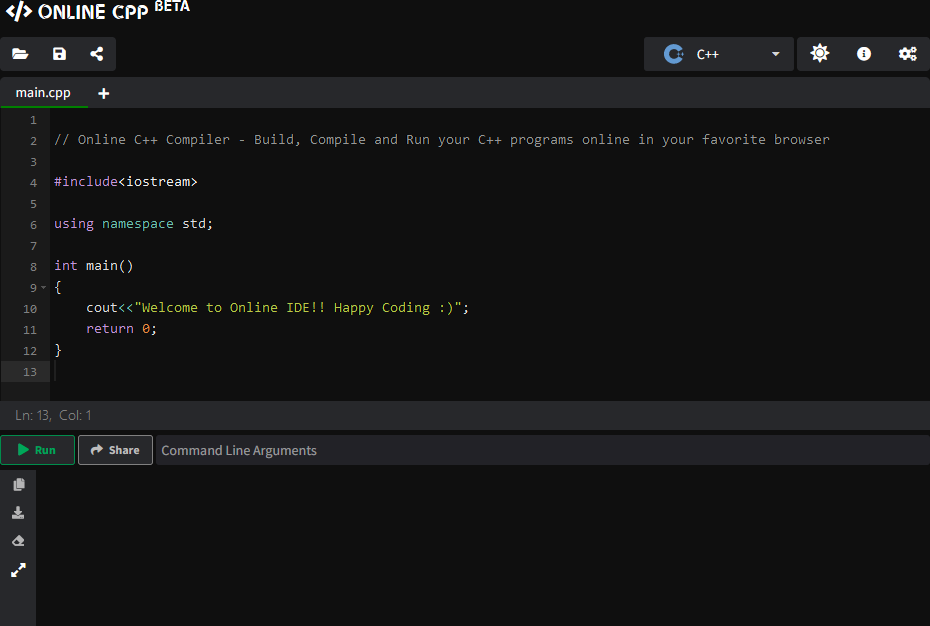
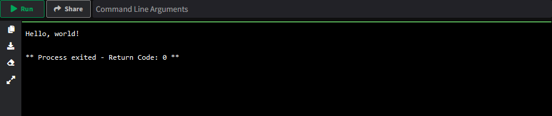

## Section 1: intro to C++

_Lower end embedded systems typically have orders of magnitude less processing power and memory compared to a laptop or even smartphone._
_This means that some of the features that make Python so easy to use, like automatic management of object creation and deletion, are not feasible on these devices._
_In these cases, we must work with a programming language that works closer to the hardware and ends up requiring the programmer do to more of the heavy lifting._
 
_C++ is one such language, and in this section you'll get familiar with the basics of C++._
_In the next section, we'll build on top of this by writing code for a device that interacts with the physical world, and testing it in a simulator._

_This section will go fast and provides analogies to Python, which you should have learned in a prior module._
_There won't be new concepts here, it's just a different look and feel (or, more formally, syntax) on top of the same ideas you already know and love._

**As you work through this, please ask questions if you have any!**


### Simulator: Online CPP

C++ code needs to be compiled (turned into machine code) before it can be run.
However, like Python, there are now websites which allow you to write programs in the browser and run them.
We've looked through a few options, and [Online CPP](https://www.online-cpp.com/) seems to be one of the better ones and is recommended.

However, if you know what you're doing, feel free to use something else - or just skip to the next section.

Online CPP starts like this (in dark mode):  


Ignore and delete the default code: this makes use of more advanced features common for PC programming and probably won't work on lower-end microcontrollers.
We'll start simpler.


## Activity 1.1: Hello world

Let's start by making sure the basics are working with the classic "hello, world" program.

**Copy this into the editor and run it (hotkey to run: F8).**
```cpp
#include <stdio.h>

int main() {
  printf("Hello, world!\n");
}
```

> <details><summary>🐍 This is roughly equivalent to this Python code...</summary>
> 
>   ```python
>   print(f"Hello, world!")
>   ```
> </details>

If everything worked, you should see this output:  


Using the code above as an example, here's a few ways C++ differs from Python:
- `#include` performs a similar function to Python's `import` (though the underlying mechanisms are very different).
  - `stdio.h` defines `printf`. 
- C++ functions are defined with their return type (here, `int`), whereas Python functions are declared using `def`.
- C++ code starts in the `main()` function, instead of starting at the top of the file.
  All code must be in functions. 
- C++ uses curly braces (`{` and `}`) to define blocks of code like the function body, instead of indentation.
- C++ statements must end with a semicolon (`;`), whereas Python infers the end of a statement from a newline.
- `printf` does not automatically add a newline, so we must do so explicitly with `\n`.
  - `\n` is interpreted into a newline.
    Formally, these backslash (`\ `) sequences are called escape sequences - sequences of characters which have a different meaning than their literal characters.

But, conceptually, C++ is also very similar to Python:
- Functions are called using parentheses (`(` and `)`) and take arguments (here, we pass the `"Hello, world!"` string to `printf`).
- Functions run one line after the other (though it's not obvious here).


## Activity 1.2: Variables, operations, and arithmetic

Now that we have the basics working, let's do some computation!

**Copy this into the editor, but before running it (hotkey: F8), read through it and see if you can guess what it does!**
```cpp
#include <stdio.h>

int main() {
  int x = 1;
  printf("x = %i\n", x);
  x = x + 2;
  printf("x = %i\n", x);
}
```

> <details><summary>🐍 This is roughly equivalent to this Python code...</summary>
> 
>   Using format syntax, structurally closer to the C++ code above
>   ```python
>   x = 1
>   print("x = {0}".format(x))
>   x = x + 2
>   print("x = {0}".format(x))
>   ```
> 
>   Using f-string syntax
>   ```python
>   x = 1
>   print(f"x = {x}")
>   x = x + 2
>   print(f"x = {x}")
>   ```
> </details>

> <details><summary>✅ If everything worked, this is the expected output...</summary>
> 
>   ```
>   x = 1
>   x = 3
>   ```
> </details>

Hopefully why you got the output you did is pretty intuitive, but let's continue to break down where C++ differs from Python. 
- C++ variables must be declared with their type (here, `int`), while Python variables do not need to be declared and are implicitly created on assignment.
  - `int` means a signed (positive or negative) integer type (whole number, positive or negative), with size platform-dependent.
    In our system, `int` is a 32-bit (4-byte) integer, with an allowable range from -2,147,483,648 = $-2^{31}$ to +2,147,483,647 = $+2^{31} - 1$ ($2^{32}$ distinct values).
  - `float` is a floating-point (decimal) type, more similar to how Python handles numbers.
    `float`s can run significantly slower than integer operations on lower-cost chips lacking dedicated hardware.
  - `bool` is a boolean type, which can either be `true` or `false`.
  - There are many more types out there, some of which we will cover later.
- Variable assignment and arithmetic have similar syntax to Python.
  - Although not shown here, C++ uses `&&` for boolean and (equivalent to Python `and`) or `||` for boolean or (equivalent to Python `or`).
- `printf` with variables is more complex.
  The first argument is the "format specifier", which is the string to print with placeholders for variables by type.
  `%i` is for an integer, while `%f` is for a float.
  These are matched (in order) to following arguments.
  - In our example, `printf("x = %i\n", x);` means to print `"x = %i"`, but replacing `%i` with the value of the first following argument, which is `x`. 

### Now you try!

Try modifying the above code to calculate the sum of 1, 2, 3, and 4.

<details><summary><span style="color:DimGrey"><b>🤔 Solution</b> (try it on your own first!)</span></summary>

  ```cpp
  #include <stdio.h>

  int main() {
    int sum = 1 + 2 + 3 + 4;
    printf("The sum is = %i\n", sum);
  }
  ```
</details>


## Activity 1.3: Conditionals and looping

While code that runs line-after-line is straightforward, real power comes from the ability to automate repetition.

**Copy this into the editor, but before running it (hotkey: F8), read through it and see if you can guess what it does!**
```cpp
#include <stdio.h>

int main() {
  for (int i=0; i<7; i++) {
    // note: the modulo operator % returns the remainder of division
    // for example, 4 % 2 = 0, and 5 % 2 = 1
    if (i % 2 == 0) {
      printf("i = %i is even\n", i);
    } else {
      printf("i = %i is odd\n", i);
    }
  }
}
```

> <details><summary>🐍 This is roughly equivalent to this Python code...</summary>
> 
>   ```python
>   for i in range(0, 7):
>     if i % 2 == 0:
>       print(f"i = {i} is even")
>     else:
>       print(f"i = {i} is odd")
>   ```
> </details>

> <details><summary>✅ If everything worked, this is the expected output...</summary>
> 
>   ```
>   i = 0 is even
>   i = 1 is odd
>   i = 2 is even
>   i = 3 is odd
>   i = 4 is even
>   i = 5 is odd
>   i = 6 is even
>   ```
> </details>

This example is a bit more complex, so let's break it down.
- `for` loops are conceptually similar to Python, but syntactically very different.
  In C++, for loops have three arguments, separated by semicolons (`;`):
  - The first is the initializer, run one before the loop begins.
    In the example, we declare the variable `i` and initialize it to `0`.
  - The second is the condition, checked before each iteration of the loop.
    If the condition is false, the loop exits.
    In the example, `i<7` checks if `i` is less than 7, stopping when `i` reaches 7.
  - The third is the increment, which is run after each iteration of the loop.
    In the example, `i++` increments `i` by one after each iteration.
- `if` blocks are pretty straightforward.
  Unlike Python, the condition must be in parentheses.
- Remember that C++ blocks are defined by curly braces (`{` and `}`) unlike Python's indentation.
  However, recommended stylistic practice (for readability) is to keep indentation consistent with code blocks.


### Now you try!

Try using loops and conditions to sum all the even numbers up to (but excluding) 1000.
Don't even try to write out all the individual numbers!

<details><summary><span style="color:DimGrey"><b>🤔 Solution</b> (try it on your own first!)</span></summary>

  ```cpp
  #include <stdio.h>

  int main() {
    int sum = 0;
    for (int i=0; i<1000; i++) {
      if (i % 2 == 0) {
        sum = sum + i;
      }
    }
    printf("The sum is = %i\n", sum);
  }
  ```
</details>


## Activity 1.4: Functions

While we've put everything in `main()` so far, it often helps to break code into smaller chunks, either to keep code more manageable and readable, or to reuse code without copy-pasting.

**Copy this into the editor, but before running it (hotkey: F8), read through it and see if you can guess what it does!**
```cpp
#include <stdio.h>

bool isEven(int x) {
  return x % 2 == 0;
}

int main() {
  for (int i=0; i<7; i++) {
    if (isEven(i)) {
      printf("i = %i is even\n", i);
    } else {
      printf("i = %i is odd\n", i);
    }
  }
}
```

> <details><summary>🐍 This is roughly equivalent to this Python code...</summary>
> 
>   ```python
>   def isEven(x):  # note that unlike C++, Python doesn't require a declared return type
>     return x % 2 == 0
> 
>   for i in range(0, 7):
>     if isEven(i):
>       print(f"i = {i} is even")
>     else:
>       print(f"i = {i} is odd")
>   ```
> </details>

> <details><summary>✅ If everything worked, this is the expected output...</summary>
> 
>   (this is the exact same as the prior activity)
>   ```
>   i = 0 is even
>   i = 1 is odd
>   i = 2 is even
>   i = 3 is odd
>   i = 4 is even
>   i = 5 is odd
>   i = 6 is even
>   ```
> </details>

Like the others, let's also break down this example.
- Functions are defined by their return type, name, and arguments.
  - In the example, `bool isEven(int x)` defines the function `isEven`, which takes one argument `x` of type `int` and returns a `bool`.
  - The body is written the same way we did for `main()`, with code statements in curly braces (`{` and `}`).
  - The difference is that since we care about the output, we use `return` to return a value.
    - Strictly speaking, `main()` should return an `int` too, though we didn't do that.

### Now you try!

Break out the sum-evens from `main` into a function, and calculate the sum of all even numbers up to (but excluding) 10, 50, 100, and 1000, all within a single program run.
Don't just copy-paste everything four times!

Consider starting from the solution in 1.3, and remember that you can call other function from with your own functions. 

<details><summary><span style="color:DimGrey"><b>🤔 Solution</b> (try it on your own first!)</span></summary>

  ```cpp
  #include <stdio.h>

  bool isEven(int x) {  // optional, you may have written x % 2 == 0 directly
    return x % 2 == 0;
  }
  
  int sumEvens(int limit) {
    int sum = 0;
    for (int i=0; i<limit; i++) {
      if (isEven(i)) {
        sum = sum + i;
      }
    }
    return sum;
  }
  
  int main() {
    printf("The sum for 10 is = %i\n", sumEvens(10));
    printf("The sum for 50 is = %i\n", sumEvens(50));
    printf("The sum for 100 is = %i\n", sumEvens(100));
    printf("The sum for 1000 is = %i\n", sumEvens(1000));
  }
  ```
</details>


That's it for the morning session on Intro to C++.
Come back in the afternoon to use what you've learned here to build and program a virtual embedded device!
