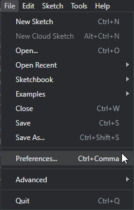
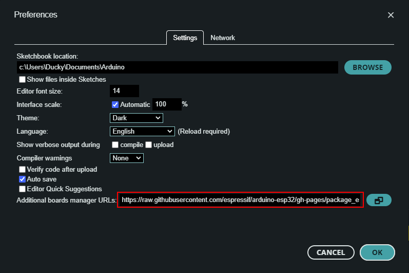
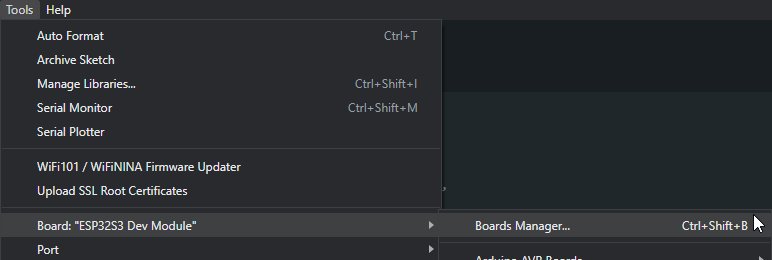
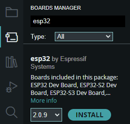
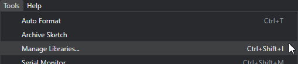
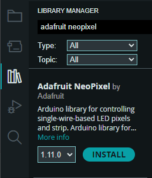

## Day 1 Homework: Setup for Day 2

Do this before the in-person lab on Day 2!
Otherwise, you may end up spending a substantial portion of the in-person lab time on setup instead of playing with fun toys.

### Install Arduino

You will need Arduino IDE 2.0 or higher, configured for the ESP32 platform, and with the required libraries.

1. Follow the [Arduino IDE installation instructions](https://support.arduino.cc/hc/en-us/articles/360019833020-Download-and-install-Arduino-IDE).
   - tl;dr: download and run the installer. 

### Install ESP32 platform

1. Start Arduino.
2. Open Preferences: **main menu > File > Preferences**  
   
3. In the Additional board manager URLs, add:  
   `https://raw.githubusercontent.com/espressif/arduino-esp32/gh-pages/package_esp32_index.json`  
   
   - If something is already there, separate the URLs with a comma.
4. Open the Boards Manager: **main menu > Tools > Board > Boards Manager**  
   
5. The Boards Manager will show up on the left panel.
   In the search box, enter `ESP32`, then click **Install** on **esp32** by Espressif Systems  
   
   - This may take a while
6. If everything worked, you can select the ESP32S3 board: **main menu > Tools > Board > ESP32S3 Boards > ESP32S3 Dev Module**  

### Install Libraries

1. Open the Library Manager: **main menu > Tools > Manage Libraries...**  
   
2. The Library Manager will show up on the left panel (where the Boards Manager was).
   In the search box, enter `Adafruit Neopixel`, and click install on **Adafruit NeoPixel** by Adafruit  
   
   - This may take a while
3. Also install these libraries:
   - **Adafruit SSD1306** by Adafruit
   - **ESP32Servo** by Kevin Harrington,John K. Bennett
   - **ESP8266Audio** by Earle F. Philhower, III 
   - If prompted to install dependencies, do so.

### Install ESPHome

ESPHome will be an optional part of the lab on low-code / no-code approaches to embedded software development.

1. Follow the [ESPHome manual installation instructions)[https://esphome.io/guides/installing_esphome.html].
   - tl;dr: install ESPHome through Python's package manager, pip.
