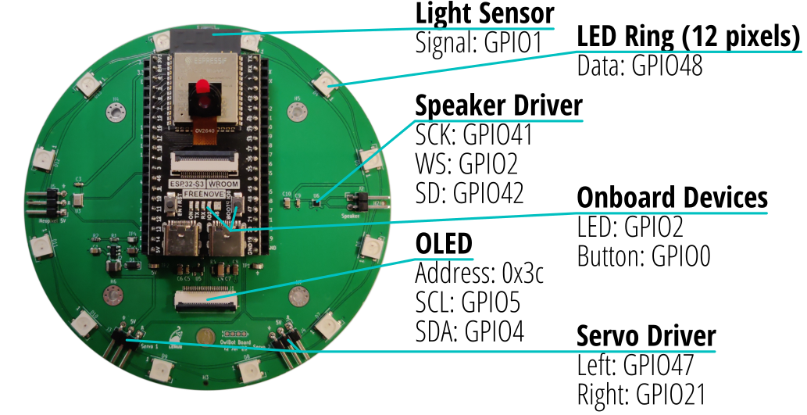

## Day 2 (in-person), section 1: working with hardware in Arduino

_Today, we'll get to program actual hardware, and including using real-world versions of the parts you used in the simulator._

_Circuit boards may contain toxic materials._
_They are safe to touch, but wash your hands prior to eating._
_Not lick-safe._

Since our focus is on the embedded programming aspect, we will be using this pre-built custom circuit board:


It has an ESP32-S3 microcontroller in a socketed daughterboard with onboard switch and LED.
The carrier board contains the LED ring (which you'd be familiar with from the simulator), a light sensor, and OLED display.
There's a few more devices that won't be part of the core lab, but if you have time you can play with then in the extra section.


### Activity 2.1: Hardware Bring-up

When bringing up new hardware, it's generally a good idea to start small and build up, instead of building everything at once and hoping it works on the first try.
While we have full code including the LED ring from yesterday and validated in the simulator, let's still work in steps.

Similarly to the last lab, the first thing we'll do is blink the LED, since this is the simplest thing that tests basic functionality
Copy this code into Arduino, then hit Upload to the board.
If all worked correctly, the LED on the daughterboard should blink about once a second.

```cpp
const int kLedPin = 2;


void setup() {
  // put your setup code here, to run once:
  pinMode(kLedPin, OUTPUT);

  Serial.begin(115200);
  Serial.println("Hello, ESP32!");
}

void loop() {
  // put your main code here, to run repeatedly:
  digitalWrite(kLedPin, HIGH);
  delay(500);
  digitalWrite(kLedPin, LOW);
  delay(500);
}
```


### Now you try!

Bring back the switch from the last lab, and use it to gate the blinking.
When the switch is pressed, the LED should blink once every second.
When the switch is not pressed, the LED should be off.

<details><summary><span style="color:DimGrey"><b>Solution</b> (try it on your own first!)</span></summary>

  ```cpp
  const int kLedPin = 2;
  const int kButtonPin = 0;
  
    
  void setup() {
    // put your setup code here, to run once:
    pinMode(kLedPin, OUTPUT);
    pinMode(kButtonPin, INPUT_PULLUP);
  }
    
  void loop() {
    // put your main code here, to run repeatedly:
    if (!digitalRead(kButtonPin)) {  // just gate the blinking with an if conditional on the button state 
      digitalWrite(kLedPin, HIGH);
      delay(500);
      digitalWrite(kLedPin, LOW);
      delay(500);
    }
  }
  ```
</details>


### Activity 2.2: Porting over the LED Ring


### Activity 2.3: Reading the Light Sensor


### Activity 2.4: OLED Display

_Let us know when you get to this part, and we'll give you an OLED display and right-angle USB connector._


### Activity 2.5: Putting it all together: Ring Light Sensor with Numeric Display

