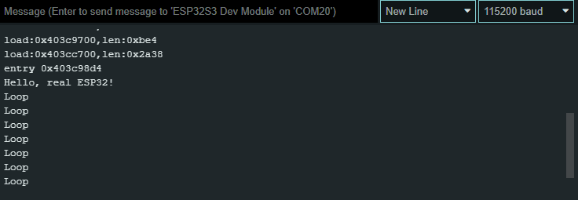
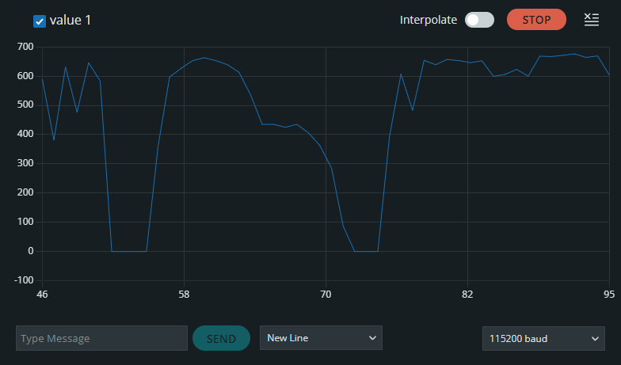

## Day 2 (in-person), section 1: working with hardware in Arduino

_Today, we'll get to program actual hardware, and including using real-world versions of the parts you used in the simulator._

_Circuit boards may contain toxic materials._
_They are safe to touch, but wash your hands prior to eating._
_Not lick-safe._

Since our focus is on the embedded programming aspect, we will be using this pre-built custom circuit board:


It has an ESP32-S3 microcontroller in a socketed daughterboard with onboard switch and LED.
The carrier board contains the LED ring (which you'd be familiar with from the simulator), a light sensor, and OLED display.
There's a few more devices that won't be part of the core lab, but if you have time you can play with then in the extra section.


## Activity 2.0: Arduino Configuration

1. Launch Arduino IDE.
2. Plug in the board to your laptop (using the RIGHT USB socket on the board - the one closer to the speaker).
3. Select ESP32S3 Dev Module as the board: **main menu > Tools > Board > esp32 > ESP32S3 Dev Module**
   - Under **esp32**, there will be a long list, but ESP32S3 Dev Module should be near the top
4. Configure the specific module: **main menu > Tools > PSRAM > QSPI PSRAM**
   - Without this, the ring LED may behave weirdly
5. Select the programming port: **main menu > Tools > Port > (your port here)**
   On most machines, there should be only one choice of port - select that.
   If you see no ports, it may not be seeing the connected board - feel free to ask for help!.
   - On Mac, ignore the `Bluetooth` port.
     You probably want the one saying `usbmodem`
   - On Windows, it will probably be the last `COM` port.


## Activity 2.1: Hardware Bring-up

When bringing up new hardware, it's generally a good idea to start small and build up, instead of building everything at once and hoping it works on the first try.
While we have full code including the LED ring from yesterday and validated in the simulator, let's still work in steps.

Similarly to the last lab, the first thing we'll do is blink the LED, since this is the simplest thing that tests basic functionality
Copy this code into Arduino, then hit Upload to the board.  


If all worked correctly, the blue LED marked IO2 on the daughterboard should blink about once a second.

```cpp
const int kLedPin = 2;


void setup() {
  // put your setup code here, to run once:
  pinMode(kLedPin, OUTPUT);
}

void loop() {
  // put your main code here, to run repeatedly:
  digitalWrite(kLedPin, HIGH);
  delay(500);
  digitalWrite(kLedPin, LOW);
  delay(500);
}
```


### Now you try!

Re-implement the switch code from the last lab, and use it to gate the blinking.
When the switch is pressed, the LED should blink once every second.
When the switch is not pressed, the LED should be off.

The button you want to press is on the right side of the daughterboard, labeled "BOOT/IO0".

This definition may be useful:  
`const int kButtonPin = 0;`

<details><summary><span style="color:DimGrey"><b>🤔 Solution</b> (try it on your own first!)</span></summary>

  ```cpp
  const int kLedPin = 2;
  const int kButtonPin = 0;
  
    
  void setup() {
    // put your setup code here, to run once:
    pinMode(kLedPin, OUTPUT);
    pinMode(kButtonPin, INPUT_PULLUP);
  }
    
  void loop() {
    // put your main code here, to run repeatedly:
    if (!digitalRead(kButtonPin)) {  // just gate the blinking with an if conditional on the button state 
      digitalWrite(kLedPin, HIGH);
      delay(500);
      digitalWrite(kLedPin, LOW);
      delay(500);
    }
  }
  ```
</details>


## Activity 2.2: Porting over the LED Ring

With the `print` and `analogRead` detour out of the way, let's test the LED ring from the last lab.

If you have simulator code from yesterday, just copy that over to the real board.
You don't need to try to merge this with the blinky LED code, we just want to test the hardware for now.
Make sure to update the pinning:  
`const int kNeoPixelPin = 48;`  
and the LED counts:  
`const int kNeoPixelCount = 12;`

Note that these LEDs are BRIGHT and you may want to lower their brightness.
If your `Adafruit_NeoPixel` object is `LedRing` as consistent with the previous lab, consider inserting this code in `setup()`:  
```cpp
LedRing.setBrightness(16);
```

Like the RGB color channels, brightness is defined from 0 to 255.
A brightness of 32 is approximately 1/8th of full brightness.

<details><summary><span style="color:DimGrey">🤔 Otherwise, you can use this reference rainbow ring code</span></summary>

  ```cpp
  #include <Adafruit_NeoPixel.h>
  const int kNeoPixelPin = 48;
  const int kNeoPixelCount = 12;
  Adafruit_NeoPixel LedRing(kNeoPixelCount, kNeoPixelPin);
  
  void setup() {
    // put your setup code here, to run once:
    LedRing.begin();
    LedRing.setBrightness(32);
  }

  int offset = 0;
  
  void loop() {
    // put your main code here, to run repeatedly:
    for (int i=0; i<kNeoPixelCount; i++) {
      int index = (i + offset) % 6;
      if (index % 6 == 0) {
        LedRing.setPixelColor(i, LedRing.Color(255, 0, 0));
      } else if (index == 1) {
        LedRing.setPixelColor(i, LedRing.Color(255, 255, 0));
      } else if (index == 2) {
        LedRing.setPixelColor(i, LedRing.Color(0, 255, 0));
      } else if (index == 3) {
        LedRing.setPixelColor(i, LedRing.Color(0, 255, 255));
      } else if (index == 4) {
        LedRing.setPixelColor(i, LedRing.Color(0, 0, 255));
      } else if (index == 5) {
        LedRing.setPixelColor(i, LedRing.Color(255, 0, 255));
      }
    }
    offset++;
    LedRing.show();
    delay(250);
  }
  ```
</details>


> <details><summary>🛠 Hardware is Hard: Fix for flickering / wrong RGBs</summary>
> 
>   For reasons we're not completely sure of, the lights might not do the right thing - maybe they flicker, or display the wrong color.
>   This may be because of an issue in the Adafruit_NeoPixel library, where issues can cause it to generate a bad signal, especially since signals are very timing-sensitive.
> 
>   One solution is to use a different library like NeoPixelBus which seems more robust in practice.
>   To use NeoPixelBus, change the defines as follows:
>   ```diff
>   - #include <Adafruit_NeoPixel.h>
>   - Adafruit_NeoPixel LedRing(kNeoPixelCount, kNeoPixelPin);
>   + #include <NeoPixelBrightnessBus.h>
>   + NeoPixelBrightnessBus<NeoGrbFeature, NeoEsp32Rmt0Ws2812xMethod> LedRing(kNeoPixelCount, kNeoPixelPin);
>   ```
> 
>   (in diff notation above, red means lines to remove, green means lines to add)
> 
>   The calls to LedRing are similar in the rest of the code, except that the first letter is capitalized and use `RgbColor(...)` instead of `LedRing.Color(...)`.
> 
>   ```diff
>   - LedRing.begin();
>   - LedRing.setBrightness(32);
>   + LedRing.Begin();
>   + LedRing.SetBrightness(32);
>     ...
>   - LedRing.setPixelColor(i, LedRing.Color(0, 255, 0));
>   - LedRing.show();
>   + LedRing.SetPixelColor(i, RgbColor(0, 255, 0));
>   + LedRing.Show();
>   ```
> 
>   The rest of the lab example code and solutions will continue using Adafruit_Neopixel, but you can swap in NeoPixelBus if that's giving you issues. 
> 
> </details>


## Activity 2.3: Print on Hardware

While a single LED used creatively can be surprisingly useful as a debugging tool, it's also pretty limiting.
And although we don't have a screen on this board (yet) like we might print on a PC, we can still send print data to a connected PC.
This is typically done using a Serial port, and is a common way to debug embedded systems.

> ⚠️ Printing data to Serial is NOT instantaneous and can take time!
> A short sentence might take a few milliseconds, but if milliseconds matter for your application (which it might!), this can throw off timing.

> <details><summary>⚡ More details about Serial...</summary>
>
>   Serial refers to a serial port, in which data is transferred one bit at a time.
>   In embedded systems, this often refers to a UART (universal asynchronous receiver-transmitter), a signalling standard for transferring bytes.
>   This is commonly used to send debugging information to a connected PC, where it can then be displayed.
> 
>   UART communications are defined in terms of baud rate, which is the number of bits per second.
>   115200 baud (a common faster speed) means 115200 bits per second.
>   At 8 bits per character, one start bit, and one stop bit, this means 11520 characters per second, or about 0.086 milliseconds per character.
> 
>   In simpler frameworks like Arduino, Serial `print`s are blocking (like `delay`) until the data transfer completes.
>   On some more advanced processors, it is possible to send serial data in the background, with `print` returning immediately while the data transfer continues.
>
>   On modern boards, a separate chip commonly adapts UART signaling to USB, which can then be directly plugged into a PC.
>   However, the concept is still the same: a stream of characters from the microcontroller to the screen, which can be displayed as text. 
> </details>

Copy this code into Arduino, but before uploading, open the Serial Monitor (**main menu -> Tools -> Serial Monitor**).
A shortcut button to launch the serial monitor is available at the top right:  


Make sure to set the baud rate to 115200.

Then, hit Upload to load the code onto the board:

```cpp
void setup() {
  // put your setup code here, to run once:
  Serial.begin(115200);
  Serial.println("Hello, real ESP32!");
}

void loop() {
  // put your main code here, to run repeatedly:
  Serial.println("Loop");
  delay(500);
}
```

By starting serial monitor beforehand, you can see the output from the board as soon as it starts running, including prints in setup().
If it all worked, wou should see this at the bottom of the Arduino IDE:  


Note that the NeoPixels retain their previous state, so those may still remain lit even if we aren't sending new commands to them.


## Activity 2.4: Reading the Light Sensor

Now that we can print text, let's try reading the light sensor.
While the prior labs have only used digital communications, this light sensor communicates using analog, by varying a voltage according to the intensity of incoming light.
Do note that the light sensor is set up so that less light means a higher voltage, while more light means a lower voltage.

Let's put these two things together, and try running this code:

```cpp
const int kLightSensorPin = 1;


void setup() {
  // put your setup code here, to run once:
  Serial.begin(115200);
  Serial.println("Hello, real ESP32!");
}

void loop() {
  // put your main code here, to run repeatedly:
  Serial.println(analogRead(kLightSensorPin));
  delay(100);
}
```

Hopefully this code reads pretty straightforwardly, but there's a few things to note:
- `analogRead(...)` returns the voltage on a pin as an integer value between 0 and 4095.
  - Typically, 0 corresponds to 0V, and 4095 corresponds to the positive voltage supply (3.3V here).
  - The full range of `analogRead(...)` depends on the particular chip, on lower-end devices with lower analog resolution this may be 0 to 1023.
- Unlike printf, println magically does the right thing based on the type of data passed into it.
  Here, it interprets an integer argument as a request to print it as a number.


### Serial Plotter

While watching numbers scroll by is better than nothing, it may not be the most intuitive way to work with data.
Arduino also provides a Serial Plotter (**main menu > Tools > Serial Plotter**), which will plot points from numbers received over Serial.



To get the value to change, try covering the light sensor with your hand, or shining a light (if you can turn on the flashlight on your phone) on it. 

> <details><summary>🛠 Hardware is Hard: why is light sensor reading fluctuating?</summary>
>
> You may notice that even under seemingly constant light, the value fluctuates.
> In the US, fluorescent lights may be fluctuating at 120Hz, too fast to be perceived by eyes which will just average out the incoming light.
> The light sensor responds much faster, and these will show up in your signal.
>
> You can try putting the sensor nearer sunlight which is much more constant.
> Some flashlights, if you have one, may also put out a more constant light source.
>
> If you want to see this high-frequency signal, try changing the `delay(...)` to 1ms and using the Serial Plotter.
> </details>


## Activity 2.5: OLED Display

_Let us know when you get to this part, and we'll provide the OLED display and right-angle USB connector._
_When connecting the OLED, be careful with the ribbon cable, and make sure the board is disconnected._

Once everything is connected and plugged back in, run this code:

```cpp
#include <Wire.h>
#include <Adafruit_GFX.h>
#include <Adafruit_SSD1306.h>

int kScreenWidth = 128;
int kScreenHeight = 64;
int kScreenAddress = 0x3c;
int kOledScl = 5;
int kOledSda = 4;

Adafruit_SSD1306 Oled(kScreenWidth, kScreenHeight, &Wire);


void setup() {
  // put your setup code here, to run once:
  Wire.begin(kOledSda, kOledScl);
  Oled.begin(SSD1306_EXTERNALVCC, kScreenAddress);
  Oled.display();
}

void loop() {
  // put your main code here, to run repeatedly:
}
```

Like the NeoPixel code, this code also uses a library that handles the details of communicating with the OLED display.
However, there's a bit more setup here:
- `Wire` is a standard Arduino library for communicating over I2C, a digital communication standard.
  It uses two physical lines, and is sometimes also called a two-wire interface.
- We need to set the pins for `Wire` using `Wire.begin(...)`
- Otherwise, similar to the NeoPixels, we also initialize the OLED using `Oled.begin(...)`, then update the display using `Oled.display()`.

If all worked, you should see the Adafruit logo on the screen.

However, a screen that displays nothing but a logo isn't very interesting, so let's draw some custom graphics:
```cpp
#include <Wire.h>
#include <Adafruit_GFX.h>
#include <Adafruit_SSD1306.h>

const int kScreenWidth = 128;
const int kScreenHeight = 64;
const int kScreenAddress = 0x3c;
const int kOledScl = 5;
const int kOledSda = 4;

Adafruit_SSD1306 Oled(kScreenWidth, kScreenHeight, &Wire);


void setup() {
  // put your setup code here, to run once:
  Wire.begin(kOledSda, kOledScl);
  Oled.begin(SSD1306_EXTERNALVCC, kScreenAddress);

  Oled.clearDisplay();
  
  Oled.drawRect(0, 0, kScreenWidth, kScreenHeight, WHITE);

  Oled.setTextColor(WHITE);
  Oled.setCursor(4, 4);
  Oled.println("Hello, OLED!");

  Oled.display();
}

void loop() {
  // put your main code here, to run repeatedly:
}
```

Hopefully most of this code is self-explanatory, but there's a few things to note:
- We need to `clearDisplay()` to clear the prior logo.
- `drawRect(x, y, w, h, color)` draws a rectangle starting at `(x, y)` and with width `w` and height `h` using the specified color.
  - To draw a box around the entire screen, we start at `(0, 0)` with width `kScreenWidth` and height `kScreenHeight`.
  - Our OLED is monochrome, so we really only have the option of `WHITE`.
- Text operations are a bit more complex.
  While draw operations contain all their arguments (position, color) in the function call, for text those are stored and configured by separate functions like `setTextColor(...)` and `setCursor(...)`.


### Now you try!

Let's start by connecting the light sensor to the OLED: print the `analogRead(...)` value to the screen.

<details><summary><span style="color:DimGrey"><b>🤔 Solution</b> (try it on your own first!)</span></summary>

  ```cpp
  #include <Wire.h>
  #include <Adafruit_GFX.h>
  #include <Adafruit_SSD1306.h>
  
  const int kLightSensorPin = 1;
  
  const int kScreenWidth = 128;
  const int kScreenHeight = 64;
  const int kScreenAddress = 0x3c;
  const int kOledScl = 5;
  const int kOledSda = 4;
  
  Adafruit_SSD1306 Oled(kScreenWidth, kScreenHeight, &Wire);
  
  
  void setup() {
    // put your setup code here, to run once:
    Wire.begin(kOledSda, kOledScl);
    Oled.begin(SSD1306_EXTERNALVCC, kScreenAddress);
  }
  
  void loop() {
    // put your main code here, to run repeatedly:
    Oled.clearDisplay();
  
    Oled.setTextColor(WHITE);
    Oled.setCursor(4, 4);
    Oled.println(analogRead(kLightSensorPin));
  
    Oled.display();
    
    delay(100);
  }
  ```
</details>

Next, try drawing a progress bar that indicates the light level.
Empty means 0, full means 4095.

You may find the Adafruit Graphics Primitives documentation useful: https://learn.adafruit.com/adafruit-gfx-graphics-library/graphics-primitives.
You may make use of both drawRect and fillRect, though feel free to experiment with other graphical operations.
One way to think of a progress bar is a box for the frame, and a filled box for the percentage complete.

⚠️ When you display both a text version and progress bar, make sure to use the same value of `analogRead()`, _without calling `analogRead()` twice!_
Consider storing the value of `analogRead()` in a variable, and using that in two places.
Different calls to `analogRead()` can return different values.

⚠️ Multiple `analogRead()`s in quick succession can distort the signal, since each read siphons a bit of charge from the line.
Make sure to add a small delay between reads.


<details><summary><span style="color:DimGrey"><b>🤔 Solution</b> (try it on your own first!)</span></summary>

  The rest of the code is the same, but replace `Oled.println(analogRead(kLightSensorPin));` in `loop()` with:

  ```cpp
  int lightValue = analogRead(kLightSensorPin);
  Oled.println(lightValue);

  Oled.drawRect(0, 32, 128, 8, WHITE);
  Oled.fillRect(0, 32, lightValue * 128 / 4095, 8, WHITE);
  ```

  `lightValue * 128 / 4095` scales the `analogRead(...)` output from 0-4095 (the analogRead output) to 0-128 (the screen width).

  We store the value of `analogRead(...)` in `lightValue` so that the text and bar values are consistent.
  Calling `analogRead(...)` twice in quick succession also affects the output (such weirdness is the joy of dealing with real hardware).
</details>


## Activity 2.6: Putting it all together: Light Sensor with LED Ring and Text Display

So now, we have a bunch of parts: a light sensor, LED ring, and OLED display.
Let's put this all together and make a somewhat-useful light sensor.

For this, update the progress bar such that maximum light (`0` from `analogRead(...)`) is a full bar, and minimum light (define your own threshold as a constant in code, based on what you observe) is an empty bar.

Then, also treat the LED ring as a progress bar, with maximum light lighting up the entire ring and minimum light lighting up none of the ring.
Avoid using the first and last pixel (the ones closest to the light sensor) to avoid those interfering with the result. 

<details><summary><span style="color:DimGrey"><b>🤔 Solution</b> (try it on your own first!)</span></summary>

  This solution first reverses the `analogRead(...)` value so that `kMinLight=1024` becomes zero, and zero becomes `kMinLight`.
  Alternatively viewed, this simultaneously reverses the value of `analogRead(...)`, and scales it to `kMinLight`.

  The rest of variations of what we've done already.

  One trick is that we avoid the first and last pixels in the LED ring by using `kNeoPixelCount - 2` pixels, then adding an offset to the pixel index to skip the first one.

  ```cpp
  const int kLightSensorPin = 1;
  
  const int kMinLight = 1024;
  
  #include <Adafruit_NeoPixel.h>
  const int kNeoPixelPin = 48;
  const int kNeoPixelCount = 12;
  Adafruit_NeoPixel LedRing(kNeoPixelCount, kNeoPixelPin);
  
  #include <Wire.h>
  #include <Adafruit_GFX.h>
  #include <Adafruit_SSD1306.h>
  const int kScreenWidth = 128;
  const int kScreenHeight = 64;
  const int kScreenAddress = 0x3c;
  const int kOledScl = 5;
  const int kOledSda = 4;
  Adafruit_SSD1306 Oled(kScreenWidth, kScreenHeight, &Wire);
  
  
  void setup() {
    // put your setup code here, to run once:
    Wire.begin(kOledSda, kOledScl);
    Oled.begin(SSD1306_EXTERNALVCC, kScreenAddress);
  
    LedRing.begin();
    LedRing.setBrightness(32);
  }
  
  void loop() {
    // put your main code here, to run repeatedly:
    Oled.clearDisplay();
  
    Oled.setTextColor(WHITE);
    Oled.setCursor(4, 4);
    
    int lightValue = analogRead(kLightSensorPin);
    Oled.println(lightValue);
  
    int reversedLight = kMinLight - lightValue;
    if (lightValue > kMinLight) {
      reversedLight = 0;  // prevent overflowing or going negative
    }
  
    Oled.drawRect(0, 32, 128, 8, WHITE);
    Oled.fillRect(0, 32, reversedLight * 128 / kMinLight, 8, WHITE);
  
    Oled.display();
  
    int pixelsLit = reversedLight * (kNeoPixelCount - 2) / kMinLight;
    for (int i=0; i<kNeoPixelCount - 2; i++) {
      if (i <= pixelsLit) {
        LedRing.setPixelColor(i + 1, LedRing.Color(0, 255, 0));
      } else {
        LedRing.setPixelColor(i + 1, LedRing.Color(0, 0, 0));
      }
    }
    LedRing.show();
  
    delay(100);
  }
  ```
</details>


## Choose your own adventure!

That's it for the base part of the lab.

If you have time, here are some more options:
- You can continue playing with the OLED and light sensor
  - Consider changing the color in addition to just the number of LEDs lit 
- If you're interested in moving parts, consider [trying the Servo extension](lab2_2_servo.md).
  You'll use a servo motor to move a mechanical dial in response to the light intensity.
- If you're interested in the Internet of Things (IoT), WiFi, or low-code / no-code approaches, consider [trying the ESPHome extension](lab2_2_esphome.md).
  You'll create a configuration file for this board, which will generate a web interface for controlling everything.
