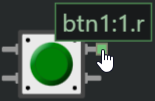

## Section 2, part 1: intro to (simulator) Arduino

_In the previous section, we learned the very basics of C++ to write simple PC programs._
_Now, we'll use that to write embedded code in a simulator._ 

_We'll write code using [Arduino](https://www.arduino.cc/), a popular platform that makes it easy to get started writing embedded programs by providing intuitive functions like `digitalWrite()` that wrap the magic happening under the hood._


### Simulator: Wokwi

Embedded code generally needs to be deployed on a physical microcontroller.
Since we're remote today, we'll use a simulator, [Wokwi](https://wokwi.com/).

You don't need to sign up for an account for what we'll be doing today.


## Activity 1.1: Hello ~~world~~ blinky

While the first example for C++ on a PC was printing "Hello, world!" to the console, embedded devices often lack a screen.
Instead, the first program is commonly to blink an LED.

Like with Hello, world!, we'll provide a base to build on.
**[Start with this linked Wokwi project](https://wokwi.com/projects/369909925978652673), which includes a circuit and example code.**  


Let's go over the circuit first:  

- At the heart is a ESP32, a low-cost microcontroller with WiFi and Bluetooth that is popular with the maker community.
  - Think of a microcontroller as a low-end computer on a chip: it has a CPU, memory, and storage.
  - It also has pins which are controlled by the processor.
    These have a variety of capabilities, but the most basic is digital GPIO (general purpose input / output).
- One of these GPIO pins (D2 in this case) is connected to an LED and resistor.
  - LEDs light up when power is applied, and the resistor limits the power to reasonable level to avoid component damage.
  - Roughly speaking for this circuit, when the GPIO is set to `1` or `HIGH`, the pin provides power to the LED.
    When the GPIO is set to `0` or `LOW`, no power is applied to the LED.

> <details><summary>⚡ A more detailed but accurate explanation of the circuit...</summary>
> 
>   - GPIOs actually function by working with voltages on the pin.
>     - On the output side, writing a `0` or `1` to the pin sets the voltage to ground (0v) or the positive supply (3.3v).
>     - On the input side, the voltage can be read from the pin, approximated to either 0 (if it's much closer to 0v) or 1 (if it's much closer to 3.3v).
>   - Pins may have other functions too, including analog (reading or writing a voltage as a more continuous value, for example 0 to 3.3v in 1024 equal steps) or digital communication protocols. 
> 
>   - LEDs light up when a current flows through them.
>     The voltage between a LED's terminals induces this current to flow.
>     - When the GPIO is set to `0`, 0v is on the pin, and there is 0v difference across the LED (to ground).
>       No current flows, LED does not light up.
>     - When the GPIO is set to `1`, 3.3v is on the pin, and there is 3.3v difference across the LED (to ground).
>       This induces current to flow across the LED, and it lights up.
>   - The resistor limits current across the LED.
>     LEDs can be damaged by excessive current (typically above 20mA for low-power LEDs), and the resistor limits the current to a reasonable amount.
> </details>

Let's move onto the code now:  
```cpp
const int kLedPin = 2;


void setup() {
  // put your setup code here, to run once:
  pinMode(kLedPin, OUTPUT);

  Serial.begin(115200);
  Serial.println("Hello, ESP32!");
}

void loop() {
  // put your main code here, to run repeatedly:
  digitalWrite(kLedPin, HIGH);
  delay(500);
  digitalWrite(kLedPin, LOW);
  delay(500);
}
```

Run it (with the arrow button) and you should see the red LED blinking on and off!  
  

While this is still C++ code, this differs from the prior examples significantly.
- There is no `main()` function, instead, there are two functions: `setup()` and `loop()`.
  `setup()` is called once on startup, after which `loop()` is repeatedly called over and over again while the program is running.
  You can think of `main()` being defined in Arduino with something like:
  ```cpp
  int main() {
    setup();
    while (true) {
      loop();
    }
  }
  ```
  - You might not have seen the `while` loop before: it keeps executing the loop while the condition is true.
    Here, the condition is always true, so it will loop forever.
    This is common in embedded systems, which often run some continuous function, instead of once-and-done.
- It's often good practice to give a name to constants, like pin numbers, instead of dropping a bare "magic number" into your code.
  - Here, we define `kLedPin` to be 2, which is the pin we've connected the LED to.
  - In other code, you may see other ways to define pins, one common one being `#define LED_PIN 2`.
    Our `const int` style uses a generally cleaner mechanism, but these are (in most cases) equivalent.
- `setup()` is commonly used to configure hardware.
  - Here, we first configure the GPIO as an output using `pinMode(...)` so it can drive the LED.
  - We also configure the serial port, which we'll use to print messages.
    Although the ESP32 doesn't have a screen, it does have a serial port (represented by the `Serial` object) that can be used to send data to a connected PC.
    - Objects are the first use of a C++ construct, up until now we've only been using C features.
      `Serial` is an object, and behaves similar to objects in Python where you can call functions on them (using the dot syntax, same as Python), and they can have internal variables.
      `Serial` is pre-defined for you by Arduino.
    - `Serial.begin(115200)` configures the baud rate (data rate, bits per second) to 115200, a common speed.
      Both the transmitter and receiver must agree on the data rate.
    - `Serial.println("Hello, ESP32!")` prints a message to the console.
      `println` includes a newline at the end, different from `printf` and `print`.
    - In Wokwi, you can see this out put when you run:  
        
      Ignore the stuff above `Hello, ESP32!`, the ESP32 prints system configuration details on startup for debugging.
- `loop()` contains the main program logic.
  - `digitalWrite(kLedPin, HIGH)` sets the pin voltage high, lighting up the LED.
  - `delay(500)` pauses the program for 500 milliseconds (0.5 seconds).
  - `digitalWrite(kLedPin, LOW)` sets the pin voltage low, turning off the LED.
  - There's one more delay, then this all repeats with the next `loop()`.
- Arduino provides a lot of functionality, and an overview reference is available here: [https://www.arduino.cc/reference/en/](https://www.arduino.cc/reference/en/)

> <details><summary>⚡ A more detailed but accurate explanation of pin directionality...</summary>
> 
>   - Internally, GPIOs have an output driver (which drives the pin voltage to either ground or positive supply) that can be turned off.
>   - When turned off (in `INPUT` mode), `digitalWrite` has no effect.
>     This is sometimes called _tristating_, referring to the third state (`0`, `1`, and undriven or `Z`).
>     - `Z` means hi-Z, or high-impedance (high-resistance) as a disconnected pin in concept has infinite resistance.
>   - When turned on, (in `OUTPUT` mode), the output driver is enabled, and the pin state is determined by `digitalWrite`.
>   - Pins can be read in output mode, this (probably) samples the voltage on the pin, which is usually the result of `digitalWrite`.
> </details>


### Now you try!

Adjust the code so that the LED blinks once every two seconds, and with 75% of the time on and 25% of the time off.

<details><summary><span style="color:DimGrey"><b>🤔 Solution</b> (try it on your own first!)</span></summary>

  For this, we only need to change the delay that controls how long the LED is on.

  ```cpp
  const int kLedPin = 2;


  void setup() {
    // put your setup code here, to run once:
    pinMode(kLedPin, OUTPUT);
  
    Serial.begin(115200);
    Serial.println("Hello, ESP32!");
  }

  void loop() {
    // put your main code here, to run repeatedly:
    digitalWrite(kLedPin, HIGH);
    delay(1500);
    digitalWrite(kLedPin, LOW);
    delay(500);
  }
  ```
</details>


## Activity 1.2: Switch input

While blinking LEDs are fun, sensing and reading inputs are typically critical parts of any useful device.

Start by adding a button to your circuit.
Click the + button to add a component (if the simulation is running, you'll need to stop it first to see the + button):  
  
- If you see this, you need to stop the simulation first:  
    

Then, select "pushbutton" from the list:  
  
The component will appear on the circuit, drag it to somewhere reasonable on the left of the ESP32:  
  
Wire the button up to the ESP32:
- Click a pin to start a wire, then click the other pin to connect them.  
  
  - While wiring, you can click anywhere to insert a bend in the wire.
- Connect the top pin of the button to D13 on the ESP32.
- Connect the bottom pin of the button to GND on the ESP32.

The connected circuit might look like this:  


With the circuit built, let's write some code to read the button.
```cpp
const int kLedPin = 2;
const int kButtonPin = 13;


void setup() {
  // put your setup code here, to run once:
  pinMode(kLedPin, OUTPUT);
  pinMode(kButtonPin, INPUT_PULLUP);

  Serial.begin(115200);
  Serial.println("Hello, ESP32!");
}

void loop() {
  // put your main code here, to run repeatedly:
  digitalWrite(kLedPin, !digitalRead(kButtonPin));
}
```

What's going on here?
- The switch is a component that connects (shorts) its pins when the button is pressed.
  - When the button is pressed, the GPIO reads a `0` (`LOW`) since the button is connected to GND.
  - We need to configure the pin as `INPUT_PULLUP` to provide a default value of `1` (`HIGH`) when the button is not pressed. 
- The `!` operator inverts the value of the expression: `0` becomes `1` and `1` becomes `0`.
  So the conditional is `true` when the button pin reads `0` (`LOW`), or pressed.

> <details><summary>⚡ A more detailed but accurate explanation of the switch...</summary>
> 
>   - When the switch is not pressed, the ESP32 pin is floating (disconnected) and indeterminate unless driven by something else.
>     From software, we can configure the pin as `INPUT_PULLUP` which enables a pull-up resistor on the GPIO pin that weakly pulls up the pin to the positive supply and reads as a digital 1.
>     - Because it's a weak pullup, the switch's connection to ground 'wins' when the button is pressed.
>   - This the conventional way to connect switches, with the pin weakly pulled high when the button is not pressed, and forced to ground when the button is pressed.
>     - You could do the opposite, but it's less common.
> </details>

Before you simulate it, what do you think will happen?

### Now you try!

While the above example completely removes the blinking LED, bring back the blinking LED with a twist: the LED should only blink when the button is pressed, and should be off otherwise.
It's up to you how long the LED takes to react to a button press or release, but opt for the simpler solution.

<details><summary><span style="color:DimGrey"><b>🤔 Solution</b> (try it on your own first!)</span></summary>

  ```cpp
  const int kLedPin = 2;
  const int kButtonPin = 13;
  
  
  void setup() {
    // put your setup code here, to run once:
    pinMode(kLedPin, OUTPUT);
    pinMode(kButtonPin, INPUT_PULLUP);
  
    Serial.begin(115200);
    Serial.println("Hello, ESP32!");
  }

  void loop() {
    // put your main code here, to run repeatedly:
    if (!digitalRead(kButtonPin)) {  // just gate the blinking with an if conditional on the button state 
      digitalWrite(kLedPin, HIGH);
      delay(1500);
      digitalWrite(kLedPin, LOW);
      delay(500);
    }
  }
  ```
</details>


## Next section

Here, we've worked with a few basic devices like switches and LEDs and covered the fundamental principles. 
In the next section, we'll explore yet more devices including the joy that is endless RGB.

[Continue to the next section.](lab2_2_devices.md)
