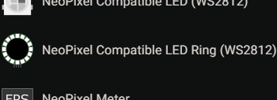
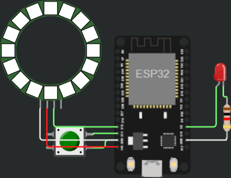
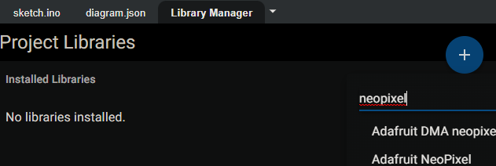
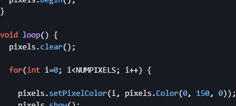

## Section 2, part 2: more devices

## Activity 1.3: NeoPixel ring

What's better than one blinking LED?
Lots of multi-color LEDs!

While we could do this with a bunch of individual LEDs, each LED would require its own individual pin from the microcontroller.
This won't scale to fun numbers of LEDs.

Instead, we'll use NeoPixels, which are devices that have an RGB (red-green-blue - can be mixed to be any color) and an integrated controller that can be controlled from a single digital signal.
Even better, these can be chained, allowing arbitrarily ridiculous numbers of LEDs to be connected from just one microcontroller pin.

> Naming note: NeoPixel is the Adafruit brand name for these devices, but informally commonly refers to a wide variety of similar devices of daisy-chainable RGB LEDs. 

> <details><summary>⚡ A more detailed explanation of NeoPixels and signals...</summary>
> 
> A digital signal is a time-varying waveform that can be used to convey data.
> NeoPixels define a protocol where the red, green, and blue intensities for each device are encoded into a series of digital `1`s and `0`s with specified timing.
> The details aren't relevant for this lab, but you can find more online if you're curious.
> </details>

Add the NeoPixel ring, just like you did with the switch:  
  
And wire it up:
- NeoPixel GND to ESP32 GND,
- NeoPixel VCC to ESP32 VIN,
- NeoPixel DIN to ESP32 D12.
- NeoPixel DOUT disconnected.

The connected circuit might look like this (yes, the wiring is a mess...):  


Now, for the software.
In theory, you could read the [chip datasheet](https://cdn-shop.adafruit.com/datasheets/WS2812B.pdf), understand the signaling protocol (page 4), and use a series of `digitalWrite(...)` and `delay(...)` to generate the required signal, but that's a lot of (actually pretty tricky) work.
Instead, for common components, especially components the maker community likes, you can typically find libraries that wraps the lower-level details into a more intuitive interface.

Here, we'll use the Adafruit NeoPixel library.
You'll need to install this in Wokwi:
- On the left, go to the Library Manager tab.
- Click the +.
- Search for "neopixel".
- Add "Adafruit NeoPixel"
  - Ignore the Adafruit DMA neopixel library



> If you're curious, you can find the library repository and readme on GitHub at [https://github.com/adafruit/Adafruit_NeoPixel](https://github.com/adafruit/Adafruit_NeoPixel).
> We'll summarize what you need to know for the lab here, but if you were working on your own, the readme is a good place to start.

> While using libraries can save you a lot of time, **there may be obligations depending on the license.**
> **Open-source does not always mean 'free for any purpose'**, some licenses, for example, require you to license your code under the same terms (usually only applicable if you distribute the software, potentially including as part of a device).
> These are legally enforceable under (a somewhat creative use of) copyright law.
> If you're the kind of person who likes to tinker with stuff or benefits from right-to-repair, why not give others the same opportunity and open-source your work too!
> And if you're the kind of person who's going to champion planned obsolescence, well you too can reap the results of heaps of unnecessary e-waste and climate change.

With the library imported, try running this example code:
```cpp
const int kLedPin = 2;
const int kButtonPin = 13;
const int kNeoPixelPin = 12;

#include <Adafruit_NeoPixel.h>
const int kNeoPixelCount = 16;
Adafruit_NeoPixel LedRing(kNeoPixelCount, kNeoPixelPin);

void setup() {
  // put your setup code here, to run once:
  pinMode(kLedPin, OUTPUT);
  pinMode(kButtonPin, INPUT_PULLUP);

  Serial.begin(115200);
  Serial.println("Hello, ESP32!");

  LedRing.begin();
}

void loop() {
  // put your main code here, to run repeatedly:
  for (int i=0; i<kNeoPixelCount; i++) {
    LedRing.setPixelColor(i, LedRing.Color(0, 150, 0));
  }
  LedRing.show();
  delay(100);
}
```

Once again, there's a few new things in this example:
- We've already covered `#include` in the prior Intro to C++ section.
- While we've covered object use above, here you have to create the `Adafruit_NeoPixel` object.
  - The syntax for creating an object in C++ is the class name, variable name, and arguments.  
    `Adafruit_NeoPixel LedRing(kNeoPixelCount, kNeoPixelPin);` means to create an object of class `Adafruit_NeoPixel`, named `LedRing`, and with arguments `kNeoPixelCount` and `kNeoPixelPin`.  
    > <details><summary>🐍 The Python equivalent would be...</summary>
    > 
    >   ```python
    >   LedRing = Adafruit_NeoPixel(kNeoPixelCount, kNeoPixelPin)
    >   ```
    > </details>
  - When you're familiar with the base language, one trick to quickly getting started with a library is to look for an example and pattern-match.
    Here, we've largely adapted the Adafruit NeoPixel example on the readme, [https://github.com/adafruit/Adafruit_NeoPixel#simple](https://github.com/adafruit/Adafruit_NeoPixel#simple):  
    
  - You can also look for the library interfaces.
    In [Adafruit_NeoPixel.h](https://github.com/adafruit/Adafruit_NeoPixel/blob/ca89075cc5091a06ac5e5f162a467b877f95f00c/Adafruit_NeoPixel.h#L219), the object constructor is defined as  
    `Adafruit_NeoPixel(uint16_t n, int16_t pin = 6,
    neoPixelType type = NEO_GRB + NEO_KHZ800);`  
    That is:
    - The first argument `n` is the number of pixels.
    - The second argument `pin` is the connected GPIO pin (defaults to `6` if unspecified).
    - The last argument `type` defines the configuration of the chip (also with a default).
- In `loop()`, we need to `setPixelColor` for each device in the chain.
  The first argument is the index of the LED (its position in the chain).
  The second argument is the color specified as an RGB value using `LedRing.Color(r, g, b)`, with each of R, G, B being a value between 0 (off) and 255 (full brightness). 

### Now you try!

A ring of green lights isn't too interesting - now, create a rainbow ring.
Specifically, the ring should have these six colors, repeating every six LEDs:
- Red (RGB 255, 0, 0)
- Yellow (RGB 255, 255, 0)
- Green (RGB 0, 255, 0)
- Cyan (RGB 0, 255, 255)
- Blue (RGB 0, 0, 255)
- Purple (RGB 255, 0, 255)

Because there are 16 LEDs which doesn't evenly divide into 6, there will be a discontinuity at the first LED.
This is fine.

Write your code in a way that's robust to different `kNeoPixelCount`.
While there's many ways to implement this, you might consider using the modulo operator `%` to determine where in the sequence of 6 colors a particular pixel is at.
For example, on LED 0, `0 % 6 = 0` for the first color, while on LED 6, `6 % 6 = 0` for the first color again after rolling around.

It's totally fine to use 6 `if` / `else if` / `else` blocks here!

<details><summary><span style="color:DimGrey"><b>🤔 Solution</b> (try it on your own first!)</span></summary>

  ```cpp
  const int kLedPin = 2;
  const int kButtonPin = 13;
  const int kNeoPixelPin = 12;
  
  #include <Adafruit_NeoPixel.h>
  const int kNeoPixelCount = 16;
  Adafruit_NeoPixel LedRing(kNeoPixelCount, kNeoPixelPin);
  
  void setup() {
    // put your setup code here, to run once:
    pinMode(kLedPin, OUTPUT);
    pinMode(kButtonPin, INPUT_PULLUP);
  
    Serial.begin(115200);
    Serial.println("Hello, ESP32!");
  
    LedRing.begin();
  }

  void loop() {
    // put your main code here, to run repeatedly:
    for (int i=0; i<kNeoPixelCount; i++) {
      int index = i % 6;
      if (index == 0) {
        LedRing.setPixelColor(i, LedRing.Color(255, 0, 0));
      } else if (index == 1) {
        LedRing.setPixelColor(i, LedRing.Color(255, 255, 0));
      } else if (index == 2) {
        LedRing.setPixelColor(i, LedRing.Color(0, 255, 0));
      } else if (index == 3) {
        LedRing.setPixelColor(i, LedRing.Color(0, 255, 255));
      } else if (index == 4) {
        LedRing.setPixelColor(i, LedRing.Color(0, 0, 255));
      } else if (index == 5) {
        LedRing.setPixelColor(i, LedRing.Color(255, 0, 255));
      }
    }
    LedRing.show();
    delay(100);
  }
  ```
</details>

### Now you try - part 2!

Now that you have a rainbow ring, have it rotate, advancing four LEDs per second (250 millisecond delay).

If you want to save state between loops, you can declare a variable outside `loop()`, and both update and read from it within `loop()`.

<details><summary><span style="color:DimGrey"><b>🤔 Solution</b> (try it on your own first!)</span></summary>

  For this, we just added an offset to the index, which increments between each loop.

  ```cpp
  const int kLedPin = 2;
  const int kButtonPin = 13;
  const int kNeoPixelPin = 12;
  
  #include <Adafruit_NeoPixel.h>
  const int kNeoPixelCount = 16;
  Adafruit_NeoPixel LedRing(kNeoPixelCount, kNeoPixelPin);
  
  void setup() {
    // put your setup code here, to run once:
    pinMode(kLedPin, OUTPUT);
    pinMode(kButtonPin, INPUT_PULLUP);
  
    Serial.begin(115200);
    Serial.println("Hello, ESP32!");
  
    LedRing.begin();
  }

  int offset = 0;
  
  void loop() {
    // put your main code here, to run repeatedly:
    for (int i=0; i<kNeoPixelCount; i++) {
      int index = (i + offset) % 6;
      if (index % 6 == 0) {
        LedRing.setPixelColor(i, LedRing.Color(255, 0, 0));
      } else if (index == 1) {
        LedRing.setPixelColor(i, LedRing.Color(255, 255, 0));
      } else if (index == 2) {
        LedRing.setPixelColor(i, LedRing.Color(0, 255, 0));
      } else if (index == 3) {
        LedRing.setPixelColor(i, LedRing.Color(0, 255, 255));
      } else if (index == 4) {
        LedRing.setPixelColor(i, LedRing.Color(0, 0, 255));
      } else if (index == 5) {
        LedRing.setPixelColor(i, LedRing.Color(255, 0, 255));
      }
    }
    offset++;
    LedRing.show();
    delay(250);
  }
  ```
</details>


## Next section

Here, we've gone beyond the simple LED... into RGBs!
Next, we'll shift gears and explore the more fundamental concept of multitasking, especially in this lower-level embedded programming environment.

[Continue to the next section.](lab2_3_multitasking.md)
