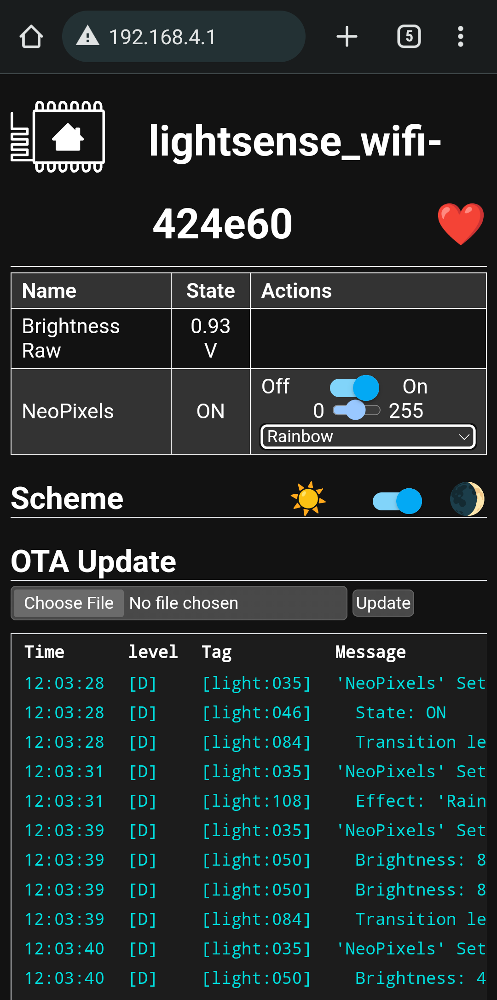

## Day 2 (in-person), choose-your-own-adventure: ESPHome and low-code / no-code

_Arduino made writing code for embedded systems easy, but you still had to write code._
_Code gives you a lot of flexibility and is great when you need to do something special, but often you don't._
_ESPHome is a code generator platform, that given a configuration file describing the hardware, will generate all the code._
_It has a library of components, including NeoPixels, servos, and many, many common sensors that are accessible to hobby builders._

_In this lab, we'll run ESPHome in standalone mode, where the device exposes a WiFi access point that serves up a control webpage._
_More commonly, these devices will connect to a home WiFi network and interact with some kind of home automation server, like [Home Assistant](https://www.home-assistant.io/)._

We've included a config file for the ring board including the NeoPixels and light sensor.
You can either copy the description below to `ring_ap.yml`, or download the included file, [ring_ap.yml](https://raw.githubusercontent.com/ducky64/lacc23-embedded/main/esphome/ring_ap.yml).

```yaml
esphome:
  name: ring_ap
  name_add_mac_suffix: true
  platform: esp32
  board: esp32-s3-devkitc-1

wifi:
  ap:
    ssid: "Ring Board"

logger:  # Print Updates

web_server:  # WebServer control interface
  port: 80
  local: true  # support running without an internet connection

light:
  - platform: neopixelbus
    id: led
    variant: WS2812
    pin: GPIO48
    num_leds: 12
    name: "NeoPixels"
    effects:
      - addressable_rainbow:
          name: Rainbow

sensor:
  - platform: adc
    pin: GPIO1
    name: "Brightness Raw"
    update_interval: 1s
```

⚠️ Make sure to change the `wifi.ap.ssid` (WiFi name) to something unique, otherwise you're going to have trouble finding your particular Ring Board.

If you've already set up ESPHome (as directed in the [setup instructions](lab2_0.md)), start a terminal in the directory containing `ring_ap.yml`, then run:
```commandline
esphome run ring_ap.yml
```

This will compile and download the firmware to the connected board.
It should start running immediately.

On either your phone or laptop, look for the WiFi network named the SSID you chose above, and connect to it.

⚠️ If your phone asks to stay connected to the network because it does not have internet, choose to stay connected.

Then, from a web browser, go to http://192.168.4.1, and you should see the ESPHome web interface (example for Android):  


This will update the voltage measured on the light sensor analog pin, and allows you to control the NeoPixel ring.
By default, you can adjust the brightness and select a rainbow pattern.


### Now you try!

ESPHome has a rich library of components with many features.
In particular, there's a bunch of patterns for the `light` component.
Read through the [light documentation](https://esphome.io/components/light/index.html) and implement more [effects](https://esphome.io/components/light/index.html#light-effects), which should show up in the dropdown menu.
Look through the list, pick one that sounds fun, and pattern match the example configuration into your `ring_ap.yml` file.

<details><summary><span style="color:DimGrey"><b>🤔 Solution</b> (try it on your own first!)</span></summary>

  One example might be to add an `addressable_color_wipe` (which scrolls random colors down the chain): 

  ```yaml
  esphome:
    name: ring_ap
    name_add_mac_suffix: true
    platform: esp32
    board: esp32-s3-devkitc-1
  
  wifi:
    ap:
      ssid: "Ring Board"
  
  logger:  # Print Updates
  
  web_server:  # WebServer control interface
    port: 80
    local: true  # support running without an internet connection
  
  light:
    - platform: neopixelbus
      id: led
      variant: WS2812
      pin: GPIO48
      num_leds: 12
      name: "NeoPixels"
      effects:
        - addressable_rainbow:
            name: Rainbow
        - addressable_color_wipe:
            name: Color Wipe Effect With Custom Values
  
  sensor:
    - platform: adc
      pin: GPIO1
      name: "Brightness Raw"
      update_interval: 1s
  ```
</details>


### Now you try! Servo edition

_Let us know if you're doing this part, and we'll provide the servo._
_The servo should be connected brown wire to ⏚ (ground) on the board, and orange wire to ⎍ (signal) on the board._
_Don't worry if you accidentally plug it in backwards, it won't work but probably won't break anything_.

_A servo here is a motor that can be controlled to move to a specific angle._

ESPHome also has a [Servo component](https://esphome.io/components/servo.html).
Add that to your config file to control the servo.
As a reminder, the left servo is `GPIO47`.

Note that this requires two entries, one for the servo itself, and an `output` component for the signal pin.
As the example code says, you'll need to use the [`ledc` component for ESP32](https://esphome.io/components/output/ledc.html).

<details><summary><span style="color:DimGrey"><b>🤔 Solution</b> (try it on your own first!)</span></summary>

  You only need to add the `servo` and `output` components to the top level of the config file.

  ```yaml
  esphome:
    name: ring_ap
    name_add_mac_suffix: true
    platform: esp32
    board: esp32-s3-devkitc-1
  
  wifi:
    ap:
      ssid: "Ring Board"
  
  logger:  # Print Updates
  
  web_server:  # WebServer control interface
    port: 80
    local: true  # support running without an internet connection
  
  light:
    - platform: neopixelbus
      id: led
      variant: WS2812
      pin: GPIO48
      num_leds: 12
      name: "NeoPixels"
      effects:
        - addressable_rainbow:
            name: Rainbow
        - addressable_color_wipe:
            name: Color Wipe Effect With Custom Values
  
  sensor:
    - platform: adc
      pin: GPIO1
      name: "Brightness Raw"
      update_interval: 1s
      
  servo:
    - id: left_servo
      output: pwm_output
  
  output:
    - platform: ledc
      id: left_servo
      pin: GPIO47
      frequency: 50 Hz
  ```
</details>


### Extra for Experts: OLED edition

ESPHome also has support for various displays, including the [SSD1306 OLED component](https://esphome.io/components/display/ssd1306.html) for the display we're using.
The OLED on the board is connected using I2C, so make sure to use the `ssd1306_i2c` platform, model `SSD1306 128x64`.
Address ix `0x3c` (default), rest pin is not connected (leave unspecified).

Unlike the other components, this one requires code within a `lambda` block, that defines what the display (referred to as `it`) should do.
You can start with the default `Hello World!`, but you can also see the full capabilities at the [`display` component documentation](https://esphome.io/components/display/index.html).
You can print values of sensors, and there's even [graphs](https://esphome.io/components/display/index.html#graph-component)!

Here is a pre-defined `i2c` component you could use, with proper pinning:
```yaml
i2c:
  sda: GPIO4
  scl: GPIO5
  frequency: 400kHz
```

To draw text, also download these pixel fonts and place them in the same folder as your `ring_ap.yml` file.
- [4x6.bdf](esphome/fonts/4x6.bdf)
- [6x10.bdf](esphome/fonts/6x10.bdf)

Then, add the config for them:
```yaml
font:
  - file: "4x6.bdf"
    id: bdf4x6
  - file: "6x10.bdf"
    id: bdf6x10
```


<details><summary><span style="color:DimGrey"><b>🤔 Solution</b> (try it on your own first!)</span></summary>

  ```yaml
  esphome:
    name: ring_ap
    name_add_mac_suffix: true
    platform: esp32
    board: esp32-s3-devkitc-1
  
  wifi:
    ap:
      ssid: "Ring Board"
  
  logger:  # Print Updates
  
  web_server:  # WebServer control interface
    port: 80
    local: true  # support running without an internet connection
  
  light:
    - platform: neopixelbus
      id: led
      variant: WS2812
      pin: GPIO48
      num_leds: 12
      name: "NeoPixels"
      effects:
        - addressable_rainbow:
            name: Rainbow
        - addressable_color_wipe:
            name: Color Wipe Effect With Custom Values
  
  sensor:
    - platform: adc
      pin: GPIO1
      name: "Brightness Raw"
      update_interval: 1s
      
  font:
    - file: "4x6.bdf"  # characters actually 3x5 plus 1px descender
      id: bdf4x6
    - file: "6x10.bdf"  # characters actually 5x7 plus 2px descender
      id: bdf6x10
      
  i2c:
    sda: GPIO4
    scl: GPIO5
    frequency: 400kHz
    
  display:
    - platform: ssd1306_i2c
      model: "SSD1306 128x64"
      address: 0x3c
      lambda: |-
        it.print(0, 0, id(bdf6x10), "Hello World!");
        it.print(0, 10, id(bdf5x7), "The quick brown fox jumps over the lazy dog");

  ```
</details>
